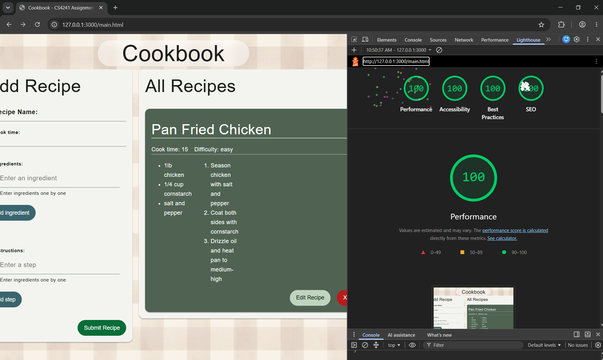

## Cookbook - A Recipe Manager

Link: https://a3-noahgaskill.onrender.com/

Cookbook is a simple recipe manager site that allows users to store and edit their recipes. Users may create an account and see all their uploaded recipes. They may change any of the details, like the name, cook time, ingredients, or steps, and they can also delete a recipe entirely if they so choose.

### Challenges: 
The main challenge I faced in building this application was the edit feature. I wanted to reuse the recipe creation form but I had to make a lot of changes for that to work. I added an edit button next to the delete one, which then grabs and prefills the form with the recipe's details. I also pass the object id (stored in the dataset attribute of the recipe table's html) to the form to send it to the update route.  I faced issues with the table not updating after the form submitted, so I had to make the buildTable function return a table, and use the javascript replaceWith() function to replace the old table with the new one, and then all the form details were reset. I also faced an odd issue where req.body was sent properly but the server was reading the fields as undefined. I'm not even sure how but it ended up fixing itself eventually.

Additionally, it was a challenge for me to give up the design I made and find a suitable framework. None really had the look I was going for. I wanted something vintage and whimsical, but most were very professional looking. Retro themes wouldn't fit, some paper ones I found were too cartoony, and others old-styled ones were too formal. Once I chose one it was also a whole lot more work than I expected to change everything over. I like the final result for the msot part, but I decided last-minute to add a logout button, and I couldn't get the formatting of that to go how I wanted. I just didn't have the time to fix it so it's a little weird positioning-wise but whatever.

### Authentication: 
I chose the basic username and password authentication. Switching the server to express, connecting to MongoDB, and adding the editing feature, and rebuilding with the framework took longer than I expected, so I chose to go with the less time-consuming method. I considered making a proper registration system alongside the login but unfortunately did not have the time to implement such a feature. I use bcryptjs security, salting and hashing the password before putting it in the database.

### CSS: 
I chose BeerCSS, as I liked how it generated a color scheme based on any color you gave it. I felt my choice of colors would be the best way to compromise and get a cozy/vintage feel despite the more professional design. I also liked how it didn't feel too minimalist either. I had familiarity with class-based frameworks from using Bootstrap in CS3733 last year, so it wasn't too difficult to work with, and I liked having more control over the styling.

I made a few overrides to the framework. The main rules were ones affecting the lists, as BeerCSS hides the markers by default, but I wanted to keep the numbers. The other changes I made were adding the background image to give my page a distinct visual identity, and making a minimum height for the recipe card for when none have been added yet.

## Technical Achievements
- **Tech Achievement 1: Lighthouse tests**: I achieved 100% on all 4 Lighthouse tests.

### Design/Evaluation Achievements
- **Design Achievement 1**: I utilized all 4 CRAP principles in designing my website. 

**Contrast**: 
On the login page, the actual login button recived the most emphasis through contrast, the dark green standing out against the green card and brown background. While there definitely could be more, I made sure that the background image and the card didn't blend together too much. On the main page, the most emphasis is on the recipes, as those are the most important information on the website. I also used contrast to make sure the buttons were visible. For the ingredient, instruction, and edit buttons, I used contrasting values to make them stand out, using a dark green or blue against the light green card, and vice versa for the edit. I contrasted colors too, using red to make the delete buttons clear and emphasized. 

**Repitition**: 
I used multiple forms of repetition throughout the site. I have a consistent heading that doesn't move throughout between pages, and keep the boxes or group of boxes with content centered. I repeat colors throughout the website too. The buttons to add list items are the same shade of green, all the delete buttons are the same shade of red. Through the framework I use a consistent color palette to make the recipe cards and the other buttons the same shade of green. The recipe cards for the logged in user get repeated within a container card, keeping them all together. All the text uses the same font provided through BeerCSS. I repeat heading sizes across the two main cards on the main page, and all the recipe cards use a consistent formatting.

**Alignment**: 
I tried to make good use of alignment to make my page more readable. For the recipe cards, I created a diagonal that helps to guide the reader through the recipe. They would start at the left-aligned title and info that take up little space across the line. Next comes the ingredients followed by the instructions, and then at the bottom and the right are the buttons to change the recipe. As the rest of the content on the login page is centered and there isn't much going on, I chose to center align the login form to keep things consistent. I align all the form content to the left, except for the delete buttons. I did not want the list to feel too cluttered, so they're opposite the ingredient/instruction items.

**Proximity**: 
My website makes use of proximity to organize the information on the page. The form and its fields are all grouped together into a single card that make it distinct from the recipe section. Within the form, I grouped the simpler name and cooktime fields together, and put the more complicated list ones together below them. The printed lists are also put right below their given fields. I put all the recipes together in the same card, seperate from the form.  Additionally, I put each of the recipes' details visually distinct by putting them in their own cards within the larger container. I grouped the buttons together in the recipe cards, and also grouped the different fields for each recipe by complexity (i.e. the simple fields together and the list fields together).
